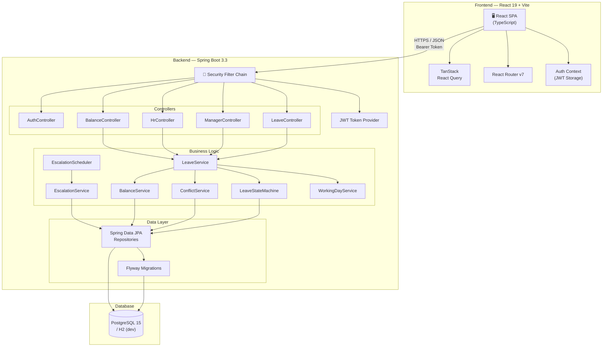
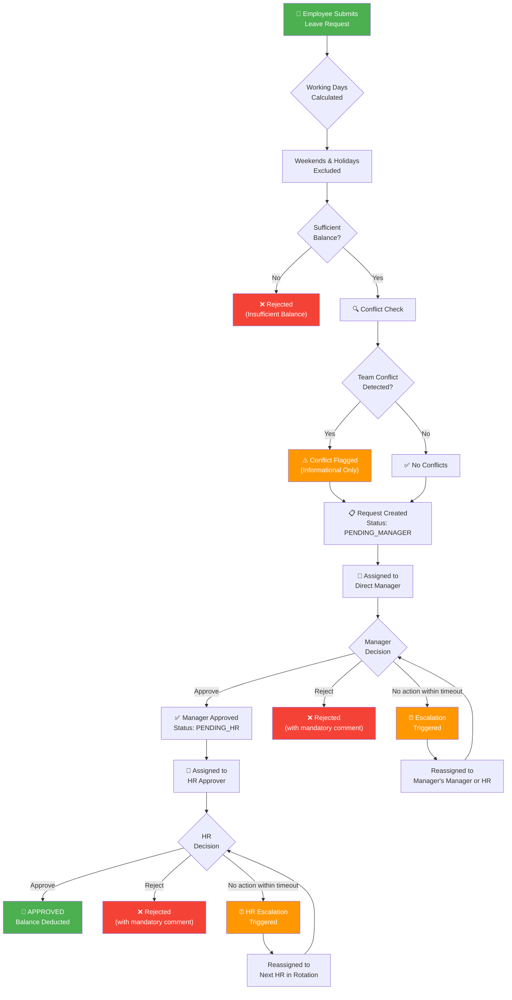
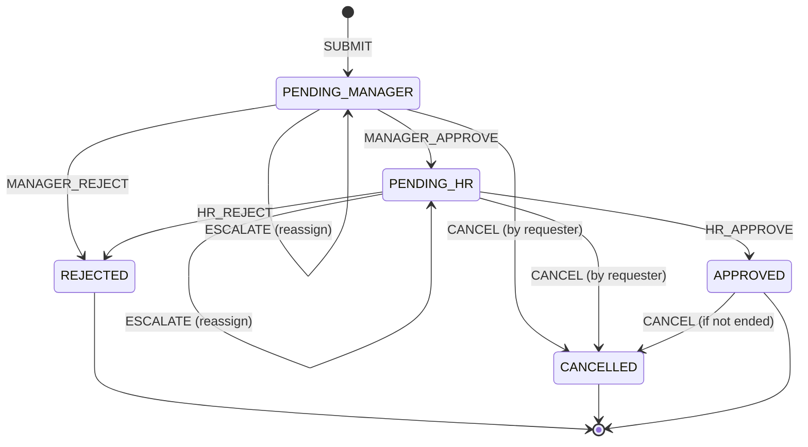
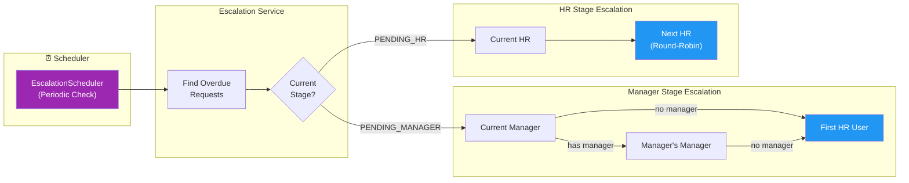
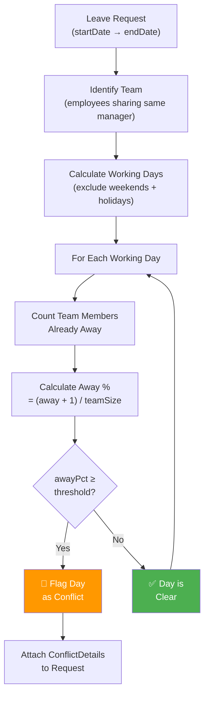
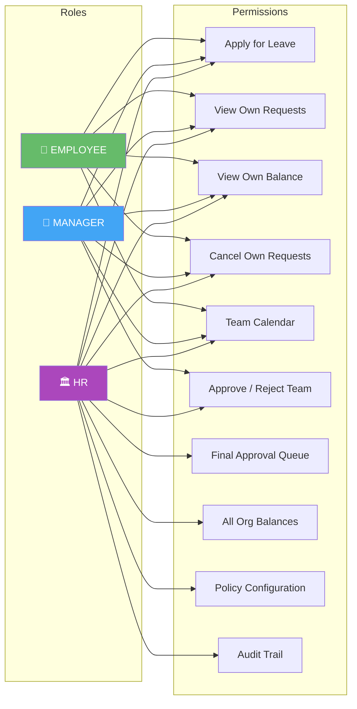
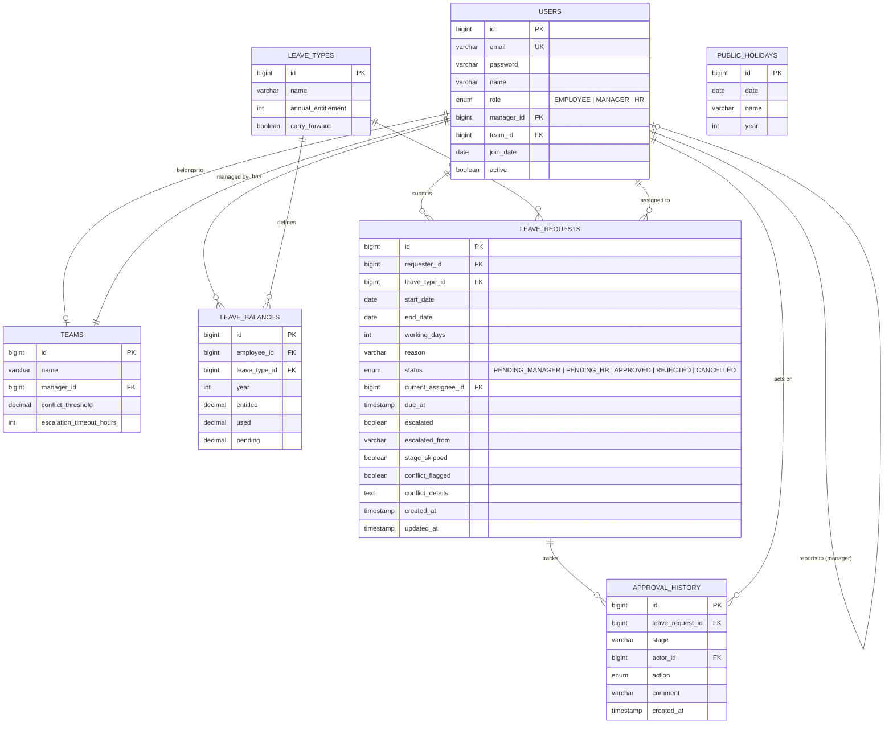
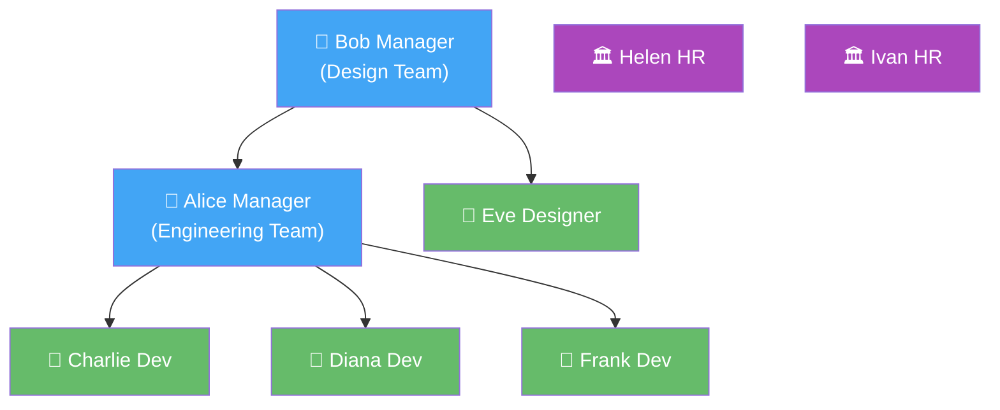

<p align="center">
  <h1 align="center">🏢 Hack Forge — Leave Management System</h1>
  <p align="center">
    A full-stack, enterprise-grade leave management platform with multi-stage approvals, automated escalation, team conflict detection, and role-based access control.
  </p>
</p>

<p align="center">
  
  
  
  
  
  
</p>

---

## 📑 Table of Contents

- [Features](#-features)
- [System Architecture](#-system-architecture)
- [Leave Approval Workflow](#-leave-approval-workflow)
- [State Machine](#-state-machine)
- [Escalation Engine](#-escalation-engine)
- [Conflict Detection](#-conflict-detection)
- [Role-Based Access Control](#-role-based-access-control)
- [Tech Stack](#-tech-stack)
- [Project Structure](#-project-structure)
- [Quick Start](#-quick-start)
- [API Reference](#-api-reference)
- [Database Schema](#-database-schema)
- [Demo Credentials](#-demo-credentials)
- [Traceability Matrix](#-traceability-matrix)
- [Testing](#-testing)

---

## ✨ Features

| Category | Features |
|----------|----------|
| **Employee** | Apply for leave · Preview working days & conflicts · View balances · Track request status · Cancel requests · Team calendar |
| **Manager** | Approve/reject team requests · View pending queue · Team calendar overview · Escalation notifications · Mid-joining leave calculator & push balance |
| **HR** | Final approval queue · Organization-wide balances · Policy configuration · Audit trail · Filterable queue · Mid-joining leave calculator & org-wide recalibration |
| **System** | JWT authentication · Auto-escalation scheduler · Conflict detection · Working day calculator · Public holiday support · Flyway migrations |

---

## 🏗 System Architecture



---

## 🔄 Leave Approval Workflow

The complete lifecycle of a leave request from submission to final resolution:



---

## ⚙️ State Machine

Every leave request transitions through a deterministic state machine. All transitions are validated for permission and recorded in the audit trail.



### Transition Rules

| Current State | Action | Next State | Actor | Constraint |
|---------------|--------|------------|-------|------------|
| `null` (new) | `SUBMIT` | `PENDING_MANAGER` | Employee | Must have sufficient balance |
| `PENDING_MANAGER` | `MANAGER_APPROVE` | `PENDING_HR` | Assigned Manager | - |
| `PENDING_MANAGER` | `MANAGER_REJECT` | `REJECTED` | Assigned Manager | Comment required |
| `PENDING_HR` | `HR_APPROVE` | `APPROVED` | Any HR user | Balance deducted |
| `PENDING_HR` | `HR_REJECT` | `REJECTED` | Any HR user | Comment required |
| `PENDING_*` / `APPROVED` | `CANCEL` | `CANCELLED` | Requester only | Cannot cancel ended leave |
| `PENDING_*` | `ESCALATE` | Same status | System (scheduler) | Reassigns approver |

---

## ⏰ Escalation Engine

Automatic escalation prevents leave requests from stalling. The scheduler runs periodically and reassigns overdue requests.



### Escalation Chain

```
Manager Stage:  Current Manager → Manager's Manager → HR Pool
HR Stage:       Current HR → Next HR (round-robin rotation)
```

Each escalation:
- Sets `escalated = true` and records `escalatedFrom`
- Marks `stageSkipped = true`
- Resets the `dueAt` timer based on team's `escalationTimeoutHours`
- Writes an `ApprovalHistory` audit entry

---

## 🔍 Conflict Detection

The conflict engine analyzes team availability for each working day in a leave request's range and flags potential overlaps.



> **Note:** Conflicts are **informational only** — they never block submission or approval. The default threshold is **40%** of the team away.

---

## 🛡 Role-Based Access Control



> HR **inherits** all Manager permissions — an HR user can access both the Manager approvals page and all HR-exclusive pages.

---

## 🛠 Tech Stack

### Backend
| Technology | Purpose |
|-----------|---------|
| **Java 17** | Language runtime |
| **Spring Boot 3.3.5** | Application framework |
| **Spring Security** | Authentication & authorization |
| **Spring Data JPA** | ORM & repository abstraction |
| **JJWT 0.12.6** | JWT token generation & validation |
| **Flyway** | Database migration management |
| **H2** | In-memory database (development) |
| **PostgreSQL 15** | Production database |
| **Jakarta Validation** | Request validation |

### Frontend
| Technology | Purpose |
|-----------|---------|
| **React 19** | UI framework |
| **TypeScript 6.0** | Type-safe JavaScript |
| **Vite 8** | Build tool & dev server |
| **React Router v7** | Client-side routing |
| **TanStack React Query v5** | Server state management & caching |
| **Axios** | HTTP client |
| **Tailwind CSS 4** | Utility-first styling |

### Infrastructure
| Technology | Purpose |
|-----------|---------|
| **Docker Compose** | Multi-container orchestration |
| **Playwright** | End-to-end testing |

---

## 📁 Project Structure

```
Hack_Forge/
├── 📄 README.md
├── 📄 docker-compose.yml
│
├── 📂 backend/                          # Spring Boot API
│   ├── 📄 pom.xml                       # Maven config
│   └── src/main/java/com/leavemanager/
│       ├── 📄 LeaveManagerApplication.java
│       │
│       ├── 📂 config/                   # Application configuration
│       │   ├── SecurityConfig.java      #   JWT filter chain, CORS, role-based endpoint security
│       │   ├── JacksonConfig.java       #   JSON serialization settings
│       │   └── ClockConfig.java         #   Injectable Clock for testability
│       │
│       ├── 📂 controller/              # REST API endpoints
│       │   ├── AuthController.java      #   POST /auth/login, GET /auth/me
│       │   ├── LeaveController.java     #   CRUD for leave requests, preview, team-calendar
│       │   ├── ManagerController.java   #   GET /manager/pending, approve/reject
│       │   ├── HrController.java        #   HR queue, policies, audit, org balances
│       │   └── BalanceController.java   #   GET /balance/me
│       │
│       ├── 📂 domain/                   # JPA entities
│       │   ├── User.java                #   Employee/Manager/HR user entity
│       │   ├── Team.java                #   Team with conflict threshold & escalation config
│       │   ├── LeaveRequest.java        #   Core leave request entity
│       │   ├── LeaveType.java           #   Annual/Sick/Personal leave types
│       │   ├── LeaveBalance.java        #   Per-employee yearly balance tracking
│       │   ├── ApprovalHistory.java     #   Audit trail entries
│       │   ├── PublicHoliday.java       #   Public holiday calendar
│       │   └── 📂 enums/
│       │       ├── Role.java            #     EMPLOYEE | MANAGER | HR
│       │       ├── LeaveStatus.java     #     PENDING_MANAGER | PENDING_HR | APPROVED | REJECTED | CANCELLED
│       │       └── LeaveAction.java     #     SUBMIT | MANAGER_APPROVE | MANAGER_REJECT | HR_APPROVE | HR_REJECT | CANCEL | ESCALATE
│       │
│       ├── 📂 dto/                      # Data Transfer Objects
│       │   ├── LoginRequest / LoginResponse
│       │   ├── LeaveSubmitRequest / LeaveRequestDto / LeavePreviewDto
│       │   ├── BalanceDto / PolicyDto / TeamCalendarDto
│       │   ├── ApprovalHistoryDto / ConflictDetail
│       │   └── UserDto / UserSummaryDto / ErrorResponse
│       │
│       ├── 📂 service/                  # Business logic
│       │   ├── AuthService.java         #   Login, JWT generation, user lookup
│       │   ├── LeaveService.java        #   Core orchestrator — submit, approve, reject, cancel
│       │   ├── LeaveStateMachine.java   #   Deterministic state transitions + audit trail
│       │   ├── ConflictService.java     #   Team overlap detection
│       │   ├── BalanceService.java      #   Balance tracking + pro-rated entitlements
│       │   ├── EscalationService.java   #   Overdue request reassignment
│       │   ├── EscalationScheduler.java #   Periodic escalation trigger
│       │   └── WorkingDayService.java   #   Working day calculation (holidays + weekends)
│       │
│       ├── 📂 security/                 # JWT infrastructure
│       │   ├── JwtTokenProvider.java    #   Token creation + validation
│       │   ├── JwtAuthenticationFilter.java  # Request filter
│       │   ├── CustomUserDetails.java   #   Spring Security UserDetails impl
│       │   └── CustomUserDetailsService.java # User loading
│       │
│       ├── 📂 repository/              # Spring Data JPA repos
│       │   ├── UserRepository.java
│       │   ├── LeaveRequestRepository.java  # Complex queries (team, overdue, etc.)
│       │   ├── LeaveBalanceRepository.java
│       │   ├── LeaveTypeRepository.java
│       │   ├── ApprovalHistoryRepository.java
│       │   ├── TeamRepository.java
│       │   └── PublicHolidayRepository.java
│       │
│       ├── 📂 exception/               # Custom exceptions
│       │
│       └── 📂 resources/db/migration/  # Flyway SQL migrations
│           ├── V1__create_users_and_teams.sql
│           ├── V2__create_leave_types_and_balances.sql
│           ├── V3__create_leave_requests_and_history.sql
│           ├── V4__create_public_holidays.sql
│           ├── V5__seed_data.sql                      # Users, teams, balances, holidays
│           ├── V6__seed_upcoming_team_leaves.sql       # Demo leave data
│           └── V7__seed_hr_and_manager_balances.sql    # HR/Manager balance seeding
│
└── 📂 frontend/                         # React SPA
    ├── 📄 package.json
    └── src/
        ├── 📄 App.tsx                   # Router + protected routes
        ├── 📄 Layout.tsx                # Sidebar navigation + layout shell
        ├── 📄 auth.tsx                  # Auth context + JWT management
        ├── 📄 api.ts                    # Axios instance with interceptors
        ├── 📄 types.ts                  # Shared TypeScript interfaces
        ├── 📄 toast.tsx                 # Toast notification system
        ├── 📄 index.css                 # Global styles + design tokens
        │
        ├── 📂 pages/
        │   ├── LoginPage.tsx            # Authentication page
        │   ├── DashboardPage.tsx        # Role-aware dashboard with stats
        │   ├── ApplyLeavePage.tsx        # Leave application form with preview
        │   ├── MyRequestsPage.tsx       # Employee's request history
        │   ├── LeaveDetailPage.tsx       # Full request detail + approval timeline
        │   ├── BalancePage.tsx           # Personal balance view
        │   ├── TeamCalendarPage.tsx      # Interactive team availability calendar
        │   ├── ApprovalsPage.tsx         # Manager approval queue
        │   ├── HrQueuePage.tsx          # HR final approval queue
        │   ├── AllBalancesPage.tsx       # Org-wide balance overview (HR)
        │   ├── PoliciesPage.tsx         # Team policy configuration (HR)
        │   └── AuditLogPage.tsx         # System audit trail (HR)
        │
        └── 📂 components/
            └── StatusBadge.tsx           # Reusable status indicator
```

---

## 🚀 Quick Start

### Prerequisites

- **Java 17+** (for backend)
- **Node.js 18+** (for frontend)
- **Docker & Docker Compose** (optional, for containerized setup)

### Option 1: Docker Compose (Recommended)

Run the entire stack with a single command:

```bash
docker-compose up --build
```

| Service | URL |
|---------|-----|
| Frontend | `http://localhost` |
| Backend API | `http://localhost:8080/api` |
| PostgreSQL | `localhost:5432` |

### Option 2: Local Development

**1. Start the Backend:**
```bash
cd backend
./mvnw spring-boot:run
```
> Uses H2 in-memory database by default. Backend runs on `http://localhost:8080`.

**2. Start the Frontend:**
```bash
cd frontend
npm install
npm run dev
```
> Frontend runs on `http://localhost:5173` with HMR.

---

## 📡 API Reference

All endpoints are prefixed with `/api` (configured via `server.servlet.context-path`).

### Authentication
| Method | Endpoint | Description | Auth |
|--------|----------|-------------|------|
| `POST` | `/api/auth/login` | Login with email/password → JWT | ❌ Public |
| `GET` | `/api/auth/me` | Get current user profile | ✅ Bearer |

### Leave Requests (Employee)
| Method | Endpoint | Description | Auth |
|--------|----------|-------------|------|
| `POST` | `/api/leaves` | Submit a new leave request | ✅ Bearer |
| `GET` | `/api/leaves/mine` | Get all of the user's requests | ✅ Bearer |
| `GET` | `/api/leaves/:id` | Get a specific leave request | ✅ Bearer |
| `POST` | `/api/leaves/:id/cancel` | Cancel own leave request | ✅ Bearer |
| `GET` | `/api/leaves/preview` | Preview working days + conflicts | ✅ Bearer |
| `GET` | `/api/leaves/team-calendar` | Team availability calendar | ✅ Bearer |

### Balance
| Method | Endpoint | Description | Auth |
|--------|----------|-------------|------|
| `GET` | `/api/balance/me` | Get current user's balances | ✅ Bearer |

### Manager
| Method | Endpoint | Description | Auth |
|--------|----------|-------------|------|
| `GET` | `/api/manager/pending` | Get pending approvals queue | ✅ MANAGER |
| `POST` | `/api/manager/leaves/:id/approve` | Approve a request | ✅ MANAGER |
| `POST` | `/api/manager/leaves/:id/reject` | Reject (comment required) | ✅ MANAGER |
| `GET` | `/api/manager/team-calendar` | Manager's team calendar | ✅ MANAGER |

### HR
| Method | Endpoint | Description | Auth |
|--------|----------|-------------|------|
| `GET` | `/api/hr/pending` | Get HR approval queue | ✅ HR |
| `POST` | `/api/hr/leaves/:id/approve` | Final approval | ✅ HR |
| `POST` | `/api/hr/leaves/:id/reject` | Final rejection (comment required) | ✅ HR |
| `GET` | `/api/hr/balances` | All employee balances | ✅ HR |
| `GET` | `/api/hr/policies` | Team policies | ✅ HR |
| `GET` | `/api/hr/audit` | Audit trail | ✅ HR |

### Mid-Joining Calculator (Manager & HR)
| Method | Endpoint | Description | Auth |
|--------|----------|-------------|------|
| `GET` | `/api/calculator/preview` | Preview pro-rated leave calculations for any join date | ✅ MANAGER / HR |
| `GET` | `/api/calculator/users` | Organization members with current & calculated pro-rated leaves | ✅ MANAGER / HR |
| `POST` | `/api/calculator/push-balance` | Push mid-joining calculated leaves to member balance | ✅ MANAGER / HR |
| `POST` | `/api/calculator/recalibrate-all` | Batch recalibrate and push for all mid-year joiners | ✅ HR |

---

## 🗄 Database Schema



---

## 🔑 Demo Credentials

All demo accounts use the password: **`password123`**

| Role | Email | Name | Team |
|------|-------|------|------|
| 🏛️ HR | `hr.helen@company.com` | Helen HR | — |
| 🏛️ HR | `hr.ivan@company.com` | Ivan HR | — |
| 🏛️ HR | `harper.hr@company.com` | Harper HR (Joined Sep 2026) | — |
| 👔 Manager | `alice.manager@company.com` | Alice Manager | Engineering |
| 👔 Manager | `bob.manager@company.com` | Bob Manager | Design |
| 👔 Manager | `marcus.manager@company.com` | Marcus Manager (Joined Aug 2026) | Design |
| 👤 Employee | `charlie@company.com` | Charlie Dev | Engineering |
| 👤 Employee | `diana@company.com` | Diana Dev | Engineering |
| 👤 Employee | `eve@company.com` | Eve Designer | Design |
| 👤 Employee | `frank@company.com` | Frank Dev (Joined Jul 2026) | Engineering |
| 👤 Employee | `george.dev@company.com` | George Dev (Joined May 2026) | Engineering |

### Team Hierarchy



---

## 📊 Traceability Matrix

| # | Requirement | Implementation |
|---|-------------|----------------|
| P1 | Roles & Authentication | `SecurityConfig.java`, `JwtTokenProvider.java`, `AuthContext.tsx` |
| P2 | Balance Service | `BalanceService.java`, `WorkingDayService.java`, `LeaveBalance.java` |
| P3 | Conflict Detection & State Machine | `ConflictService.java`, `LeaveStateMachine.java` |
| P4 | Manager / HR Approval Flow | `ManagerController.java`, `HrController.java`, `ApprovalsPage.tsx` |
| P5 | Escalation & Audit | `EscalationService.java`, `EscalationScheduler.java`, `ApprovalHistory.java` |
| P6 | Shared UI Framework | `Layout.tsx`, `index.css`, `App.tsx` router |
| P7 | Employee UI | `ApplyLeavePage.tsx`, `DashboardPage.tsx`, `MyRequestsPage.tsx`, `TeamCalendarPage.tsx` |
| P8 | Manager UI | `ApprovalsPage.tsx`, `LeaveDetailPage.tsx` |
| P9 | HR UI | `HrQueuePage.tsx`, `AuditLogPage.tsx`, `AllBalancesPage.tsx`, `PoliciesPage.tsx` |
| P10 | Polish & E2E | `docker-compose.yml`, Playwright tests, `README.md` |

---

## 🧪 Testing

### End-to-End Tests (Playwright)

```bash
cd frontend
npx playwright install    # first-time setup
npm run test:e2e
```

### Backend Tests

```bash
cd backend
./mvnw test
```

---

## 📜 License

This project was built for the **Hack Forge** hackathon.
