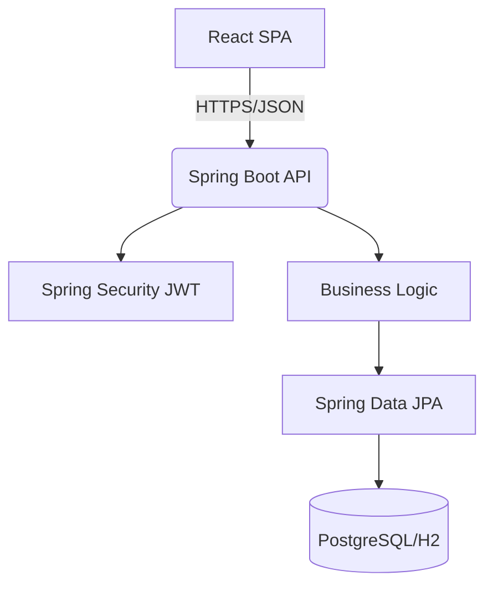

# Hack Forge: Leave Management System

A comprehensive leave management application built with Spring Boot and React.

## Architecture



## Quick Start

### Docker Compose
Run the entire stack (PostgreSQL, Backend, Frontend) with a single command:
```bash
docker-compose up --build
```
The frontend will be available at `http://localhost`, and the backend API at `http://localhost/api/`.

### Local Development
**Backend:**
```bash
cd backend
./mvnw spring-boot:run
```

**Frontend:**
```bash
cd frontend
npm install
npm run dev
```

## Demo Credentials (password123 for all)

| Role     | Email                         |
|----------|-------------------------------|
| HR       | hr.helen@company.com          |
| Manager  | alice.manager@company.com     |
| Employee | frank@company.com             |

## Traceability Table

| Requirement | Implementation Location |
|-------------|-------------------------|
| P1: Roles & Auth | `SecurityConfig.java`, `AuthContext.tsx` |
| P2: Balance Service | `BalanceService.java`, `WorkingDayCalculator.java` |
| P3: Conflicts & State | `ConflictService.java`, `LeaveStateMachine.java` |
| P4: Manager/HR Approval | `ApprovalService.java`, `/manager/pending` |
| P5: Escalation & Audit | `EscalationService.java`, `EscalationScheduler.java` |
| P6: UI Shared | `Tailwind config`, `App.tsx` router |
| P7: Employee UI | `ApplyLeavePage.tsx`, `Dashboard.tsx` |
| P8: Manager UI | `ApprovalsPage.tsx` |
| P9: HR UI | `HrQueuePage.tsx`, `AuditLogPage.tsx` |
| P10: Polish & E2E | `e2e.spec.ts`, `docker-compose.yml`, `README.md` |

## End-to-End Tests
To run the Playwright headless E2E tests:
```bash
cd frontend
npm run test:e2e
```
